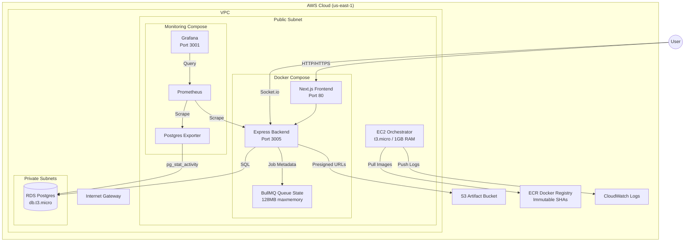

# GridNode Architecture

GridNode relies on a secure, single-host AWS footprint to distribute decentralized compute jobs.

```mermaid
graph TD
    subgraph "AWS Cloud (us-east-1)"
        subgraph "VPC"
            IGW[Internet Gateway]
            
            subgraph "Public Subnet"
                EC2[EC2 Orchestrator\nt3.micro / 1GB RAM]
                
                subgraph "Docker Compose"
                    FE[Next.js Frontend\nPort 80]
                    BE[Express Backend\nPort 3005]
                    Redis[BullMQ Queue State\n128MB maxmemory]
                end
                
                subgraph "Monitoring Compose"
                    Prom[Prometheus]
                    Graf[Grafana\nPort 3001]
                    PGExp[Postgres Exporter]
                end
            end
            
            subgraph "Private Subnets"
                RDS[(RDS Postgres\ndb.t3.micro)]
            end
        end
        
        S3[S3 Artifact Bucket]
        ECR[ECR Docker Registry\nImmutable SHAs]
        CW[CloudWatch Logs]
    end

    User((User)) -->|HTTP/HTTPS| FE
    User -->|Socket.io| BE
    
    FE --> BE
    BE -->|SQL| RDS
    BE -->|Job Metadata| Redis
    BE -->|Presigned URLs| S3
    
    EC2 -->|Push Logs| CW
    EC2 -->|Pull Images| ECR
    
    Prom -->|Scrape| BE
    Prom -->|Scrape| PGExp
    PGExp -->|pg_stat_activity| RDS
    Graf -->|Query| Prom
```
